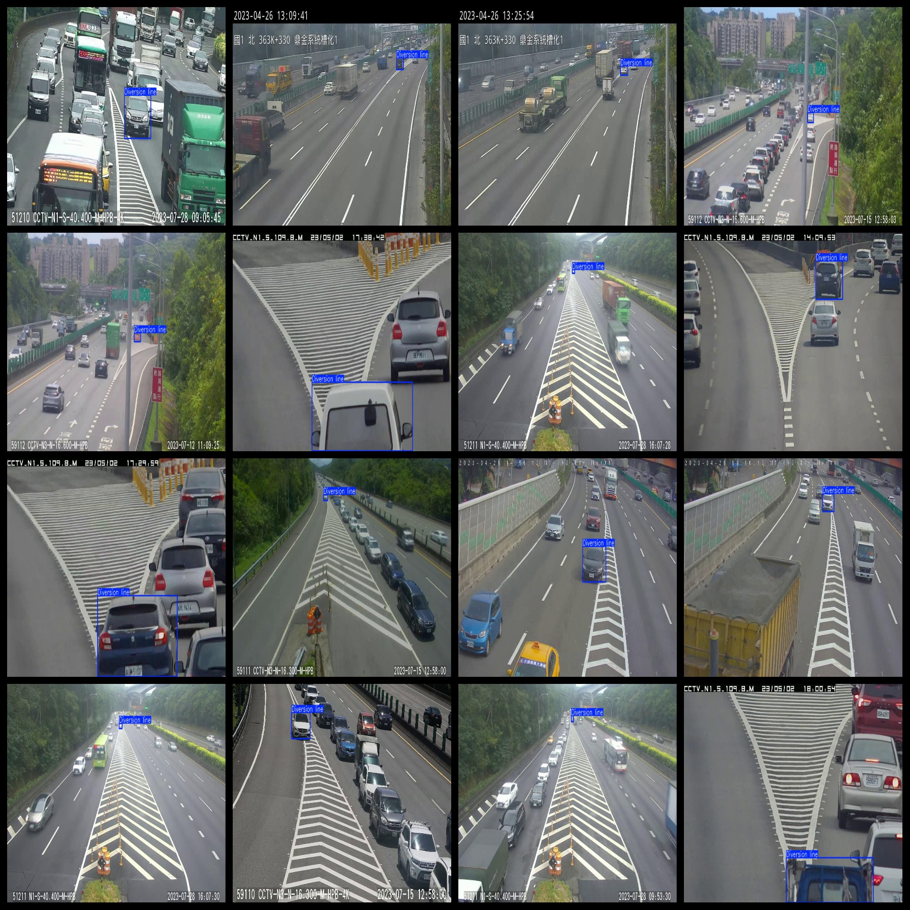
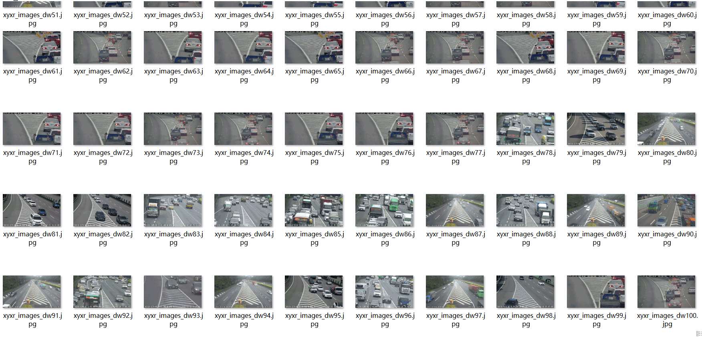

# Fixed View Captured High-Speed Vehicle Driving over the line at the intersection diversion line Detection Dataset 4331 imagesVOC+YOLO format

Fixed view 4331 VOC + YOLO datasets for high-speed vehicles crossing the line at intersections

Dataset format: Pascal VOC format + YOLO format (the txt file does not contain the split path, it only contains jpg images and corresponding VOC format xml files and yolo format txt files)

Number of images (total number of jpg files): 4331

Number of annotations (number of xml files): 4331

Number of txt files: 4331

Number of categories: 1

The Github repository is: datasets_sl

Category Name: ["Diversion line"]

Number of boxes labeled in each category:

Diversification line Frames = 4416

Total number of frames: 4416

Number of images per category:

Diversion line occupies = 4331

Image resolution: 960x540

Use the labeling tool: labelImg

Dataset Augmentation: No

Rules for annotation: Draw a rectangle around the category.

Important note: The dataset does not have been divided into training, validation, and testing sets.

Special Disclaimer: This dataset does not guarantee the accuracy of the trained models or weight files.

Annotation and image details are as follows:

## Images

---

Here is a pay link on Stripe (https://buy.stripe.com/3cs8yP7sY87d0vu9AB). Please contact me lonlonago@foxmail.com after funding $89, and I will send you a complete data files, thank you!

